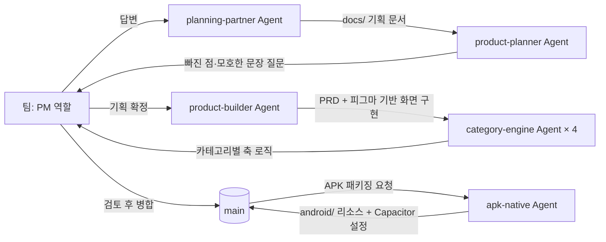
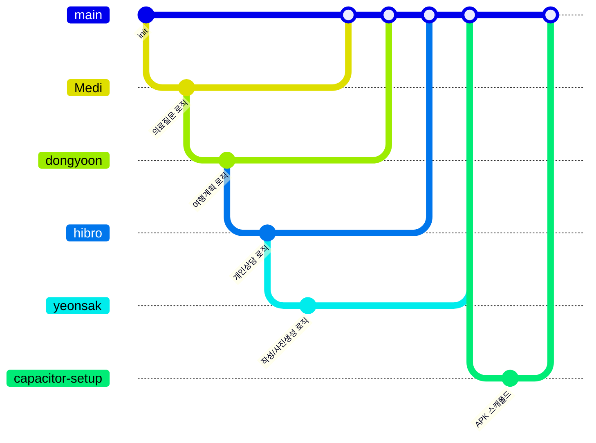

# 알잘딱 (AlJalTtack)

> AI에게 뭘 어떻게 물어봐야 할지 막막한 비전공자·고령자가, 편하게 쓴 문장을 그대로 붙여넣기만 하면 카테고리별 규칙으로 정제된 프롬프트를 받는 서비스.

| 항목 | 내용 |
|---|---|
| 팀명 | beast_boys |
| 팀원 | 우석민(의료질문 카테고리 · 인프라/배포 전반), 김동윤(여행계획 카테고리 · 기술/버그 이슈 대응), 이재성(개인상담 카테고리 · 디자인 이슈 대응), 조연익(작성·AI사진생성 카테고리 · 디자인 이슈 대응) |
| 기간 | 2026.MM.DD ~ 2026.09.22 <!-- 정확한 시작일 미상, 약 2주+ 진행 --> |
| 배포 링크 | https://proto-design-psi.vercel.app |
| 피그마 | https://www.figma.com/make/n5iqcqpul1SeRcEM90eW0t/AI-프롬프트-도우미-프로토타입--복사-?t=3J8B9gbC1rNw5w9a-1 |
| Claude Design | 사용 안 함 — 피그마(Figma Make)만으로 디자인·프로토타입을 진행 |

---

## 1. 프로젝트 소개

### 문제 정의
- 타깃 사용자: AI에게 질문은 하고 싶지만 프롬프트를 어떻게 구체화해야 할지 막막한 비전공자·고령자
- 겪는 문제: "다음 달에 도쿄 여행 가려고 해요" 같은 짧고 단편적인 문장만 던지고, AI가 되묻는 세부 조건(목적·톤·대상 등)을 스스로 채워 넣지 못한다. AI 모델 자체의 이해력이 부족한 게 아니라, **사용자가 자기 의도를 구조화해서 표현하는 것 자체가 병목**이라는 게 이 프로젝트의 핵심 전제다.
- 우리의 해결: 자연어로 편하게 쓴 문장을 입력받아 카테고리별 규칙 기반 엔진이 축(목적·대상·톤 등)을 자동 감지하고, 사용자가 그 축을 눈으로 보면서 클릭 몇 번으로 조정하면 바로 복사해 쓸 수 있는 정제된 프롬프트를 만들어준다.

### MVP 기능
| 우선순위 | 기능 | 상태 |
|---|---|---|
| 1 | 카테고리별(의료질문·여행계획·개인상담·작성·AI사진생성) 축 감지 + 정제 프롬프트 생성 | 완료 |
| 2 | 축 조정 UI(비교 화면) — 실시간 재생성, 변경 지점 하이라이트 | 완료 |
| 3 | 복사/공유(Web Share API) + 피드백(👍/👎)·난이도 설문 저장(Neon) | 완료 |
| 4 | 예시 프롬프트 라이브러리 | 완료 |
| 5 | 모바일 반응형 레이아웃 | 완료 |
| 6 | 관리자 대시보드(피드백 통계) | 완료 |
| 7 | Chrome 확장(사이드패널, 4개 AI 서비스 자동 삽입) | 완료(스토어 미제출, 로컬 설치용) |
| 8 | Android APK 패키징(Capacitor) | 일부 — 스플래시 화면만 별도 담당자 작업 중 |

### 범위에서 제외한 것
- **Chrome 웹스토어 정식 등록** — 이유: 수업 과제 범위에서 스토어 심사·정책 대응까지는 불필요하다고 판단, "언패킹된 확장 프로그램 로드"까지만 지원.
- **Android 오버레이 앱(다른 앱에 자동 삽입)** — 이유: "복사/공유로 텍스트만 건네준다"는 기존 스코프를 벗어나는 별도 접근성 서비스가 필요해 다음 마일스톤으로 미룸.
- **부정 표현 처리("~는 아니고")** — 이유: 규칙 기반 엔진에서 정확히 처리하려면 끝없이 예외가 늘어나는 영역이라 판단, 사용자가 축 버튼을 다시 눌러 정정하는 흐름으로 충분하다고 결정.
- **출력 형식·길이·어조 등 프롬프트 요소 일부** — 이유: 이 서비스의 목표는 "AI가 되물을 정보를 사용자 대신 구조화해서 채워주는 것"이지, 프롬프트 엔지니어링 전 영역을 대신해주는 게 아니다. 의도적으로 다루지 않는 스코프로 정책 문서에 명시.

### 정상 흐름
1. **시작 화면** — 자연어로 하고 싶은 말을 쓰고 카테고리 5개 중 하나를 고른다.
2. **비교 화면** — 자동 감지된 축을 확인·조정하면서 오른쪽에서 실시간으로 정제되는 프롬프트를 본다(바뀐 부분은 색으로 하이라이트).
3. **복사/공유** — 완성된 프롬프트를 복사하거나(모바일은 공유 버튼도) 원하는 AI 서비스에 붙여넣는다.

### 예외 흐름
| 상황 | 사용자에게 보이는 것 | 다음 행동 | 구현 여부 |
|---|---|---|---|
| 카테고리 미선택 / 빈 입력 | "카테고리를 선택해주세요" / "내용을 입력해주세요" — 각각 다른 안내 문구, 버튼 비활성화 | 입력 후 재시도 | ✅ |
| 500자 초과 | "500자 이내로 입력해주세요" | 글자 수 줄여서 재시도 | ✅ |
| 부적절한 표현(욕설) 감지 | "부적절한 표현을 지워주세요" + 미리보기에서 마스킹 표시 | 표현 수정 후 재시도 | ✅ |
| 클립보드 복사 실패 | "자동 복사에 실패했어요" 안내 + 수동 선택 복사 영역 노출 | 직접 선택해서 복사 | ✅ |
| 의료질문/개인상담 위기 신호 감지(자해·응급 등) | 고정된 안전 문구(119/상담 핫라인 안내) 항상 노출 | AI 응답과 별개로 실제 도움 경로 확인 | ✅ |
| 재조정 3회 이상 반복 | ARCADE HINT 팝업(1회 노출 후 닫으면 재노출 안 함, 다시 볼 수 있는 버튼 상시 노출) | 힌트 확인 또는 계속 조정 | ✅ |
| 재조정 3회 이상 + 👍/👎 클릭 | 어려웠던 점 객관식 설문 노출 | 응답 시 서버에 저장 | ✅ |

### 기획 문서
- 카테고리별 축·키워드 정본: [`prd/`](prd/)
- 전체 요구사항·정책·기능 정의(별도 리포): [`planning-document/docs/`](https://github.com/Beast-Boys-B/planning-document/tree/main/docs)

---

## 2. 디자인 시스템

<!-- TODO: 실제 화면 스크린샷 캡처해서 docs/images/design-system.png로 추가 -->

### 사용 도구와 역할
| 도구 | 어느 단계에 썼나 | 원본 여부 |
|---|---|---|
| 피그마(Figma Make) | 색·타이포·컴포넌트 정의 + 화면 목업 생성, 프로토타입을 실제 React 코드로 1차 export | 원본 |
| Claude Design | 사용 안 함 | — |

피그마(Figma Make)가 유일한 디자인 원본이다 — Figma Make export를 기반으로 `product-builder` Agent가 실제 화면(`src/pages/`)을 구현했고, 이후 실기기/실사용 테스트로 나온 수정사항은 코드에서 직접 반영했다.

### 정의
| 구분 | 정의 |
|---|---|
| 색상(공통) | Primary(LIME) `#CCFF00`, Ink `#111111`, Background(Ivory) `#FAFAF8` |
| 색상(카테고리별 강조색) | 의료질문 `#EF4444`(red) · 여행계획 `#06B6D4`(cyan) · 개인상담 `#10B981`(emerald) · 작성 `#F97316`(orange) · AI사진생성 `#A855F7`(purple) |
| 색상(축 하이라이트, 4슬롯 고정) | `#D97706`(amber) · `#DB2777`(magenta) · `#4F46E5`(indigo) · `#64748B`(slate) |
| 타이포 | 제목 `Black Han Sans`/`Noto Sans KR`, 본문 `Noto Sans KR`, 아케이드 포인트 `Silkscreen` |
| 톤 | 오락실/아케이드 게임 느낌(픽셀 폰트, 네온 라임 포인트, 카드형 UI) |

### 컴포넌트 목록
- `ArcadeHeaderBar` (크레딧/점수/카테고리 배지가 있는 상단바)
- 카테고리 카드(호버 시 확장)
- 축 선택 버튼(단일선택 / "A + B 모두" 다중선택)
- `HashtagToggle`(예시 해시태그 칩)
- 정제 프롬프트 박스(하이라이트 렌더링 포함)
- ARCADE HINT 팝업 / 난이도 설문 카드
- 라이브러리 상세 바텀시트(모바일)

### 디자인 vs 구현
<!-- TODO: 피그마 화면 캡처 / 실제 배포 화면 캡처를 나란히 넣기 -->

---

## 3. Agent 구성

이 프로젝트는 기획(planning-document 리포)과 구현(이 리포)이 분리돼 있어서, 단계별로 서로 다른 역할의 Claude Code 서브에이전트를 뒀다.



### 역할별 Agent
| Agent | 역할 | 입력 | 출력 | 제약 |
|---|---|---|---|---|
| `planning-partner` | 기획 인터뷰 진행, docs/ 문서 대필 | 팀의 답변 | `docs/`의 요구사항·정책·기능 문서 | 팀 대신 결정하지 않음, 발산 아이디어는 `[제안]` 태그로만 |
| `product-planner` | 기획 문서 검증 | `docs/` 문서 | 빠진 것·모호한 문장에 대한 질문 목록 | 문서를 대신 채워 쓰지 않음 |
| `product-builder` | PRD + 피그마 기반 화면 구현 | PRD 문서, 피그마 프로젝트 | 실제 화면 코드 | 첨부 밖의 것을 만들지 않음, 서버·새 폴더가 필요하면 만들지 않고 되물음 |
| `category-engine` | 카테고리 1개의 축 감지 로직 구현 | `prd/<카테고리>.md` | `src/categories/<카테고리>.ts` | 자기 카테고리 파일 밖(다른 카테고리·`types.ts`·`App.tsx`)은 안 건드림, 스키마에 없는 걸 지어내지 않음 |
| `apk-native` | Capacitor 안드로이드 네이티브 리소스 관리 | 아이콘·스플래시·플러그인 설정 요청 | `android/app/src/main/res/**`, `capacitor.config.ts` | `build.gradle`·`AndroidManifest.xml`·`MainActivity.java`·웹 소스는 안 건드림 |

`category-engine`은 4명이 동시에 같은 코드베이스를 바이브 코딩할 때 서로 파일이 겹치지 않게 하려는 목적으로 만들어졌다 — 카테고리별 로직이 `src/categories/<이름>.ts` 한 파일 안에만 있어서, 각자 자기 파일만 고치면 절대 충돌이 안 난다.

### 지시문 핵심 발췌 (`category-engine.md`)
```
- 자기 카테고리 파일 하나만 쓰고 고친다 — 다른 카테고리 파일, categories/types.ts,
  categories/index.ts, App.tsx, theme.ts, components/, pages/ 전부 읽기만 한다.
- 공유 계약(categories/types.ts)을 임의로 바꾸지 않는다. 필요해 보이면 마음대로
  고치지 말고 "공유 파일 변경이 필요해 보인다"고 사람에게 먼저 알린다.
- 매칭 방식을 스키마가 나눈 대로 정확히 구현한다 — 명사 어근(조사 무관)과
  구문형(그대로 매칭)을 뭉뚱그리면 실제 버그가 된다(작성 카테고리에서 있었던 문제).
- 스키마에 없는 걸 지어내지 않는다. 애매한 부분은 // TODO(schema-[?]) 주석으로
  남기고 지금 동작(자리표시자)을 유지한다.
```

### 지시문 수정 이력
- `AGENTS.md`: "자기 브랜치에서 작업" 규칙이 처음엔 "공유 브랜치를 당겨온 뒤 작업"처럼 애매하게 적혀 있어서, `main`에 직접 커밋하는 걸 명시적으로 막지 못했다 — "not `main` directly"를 못박고 실제 브랜치 이름 예시(`Medi`=의료질문)까지 추가하는 걸로 수정.

---

## 4. 프로젝트 규칙 (하네스)

### AGENTS.md / CLAUDE.md 핵심
`CLAUDE.md`는 `@AGENTS.md`로 위임 — 실제 규칙은 `AGENTS.md`에 있다.
- **코드 컨벤션**: 문자열은 큰따옴표(아포스트로피 포함 시 빌드 깨짐 방지), JSX 태그·중괄호 짝 맞추기, 컴포넌트는 default export.
- **폴더 구조**: `src/categories/`(카테고리별 로직 1파일 1카테고리), `src/pages/`(화면), `src/components/`(공용 UI), `api/`(Vercel 서버리스), `prd/`(카테고리 스키마 정본).
- **금지 사항**: 자기 카테고리 파일 밖 수정 금지, 공유 파일(`types.ts`/`index.ts`/`App.tsx`) 단독 변경 금지(팀 공지 먼저), `prd/<카테고리>.md`와 코드가 다르면 코드를 고침(반대 금지).

### 만들어 둔 Skill / Agent
| 이름 | 하는 일 | 비고 |
|---|---|---|
| `category-engine` | 카테고리별 축 로직 구현 경계 강제 | 4개 카테고리 전부에 반복 사용 |
| `apk-native` | Capacitor 안드로이드 리소스 경계 강제 | 아이콘 교체 3회, 스플래시 인수인계에 사용 |
| `planning-partner` / `product-planner` | 기획 문서 인터뷰·검증 | planning-document 리포에서 5개 카테고리 문서 작성에 반복 사용 |

### 검증 절차
1. 코드 변경 후 `npx tsc --noEmit` + `npm run build`로 타입/빌드 확인 — 저장소 전체 관행.
2. 디자인/레이아웃 변경은 로컬 개발 서버(`npm run dev`)를 띄우고 실기기(모바일)·에뮬레이터에서 직접 확인.
3. 이미지 리소스(아이콘 등)는 바이트 단위로 검증 — `.gitattributes`의 전역 `*.png` LFS 규칙 때문에 새 경로의 PNG가 자동으로 LFS 포인터로 치환되는 사고가 반복돼서, 커밋 전 `git show :<path> | head -c 16 | xxd`로 실제 PNG 바이트인지 확인하는 절차가 생겼다.

**실제 사례**: 안드로이드 앱 아이콘을 3번 연속 잘못 만들었다.
1. 잘못된 원본 파일(배경 있는 PNG)을 썼다가 → 실제로 반영해야 할 SVG로 교체.
2. 그 SVG가 이미지 레이어 2개(도형+텍스트)로 구성된 걸 정규식이 첫 번째 것만 잡아서 텍스트가 빠진 채 깨짐 → 레이어 전부 추출해서 원래 순서대로 재합성.
3. 안드로이드 어댑티브 아이콘의 원형 마스크가 세이프존 없이 꽉 채운 이미지의 모서리(말풍선 꼬리)를 잘라먹음 → 구글 공식 세이프존 비율(66/108)로 축소해서 재생성.
매 단계 실기기 스크린샷으로 확인 후 다음 시도로 넘어갔고, 최종적으로 "추천 앱" 표시줄이 아이콘에 색 테두리를 씌우는 런처 자체 동작이었다는 것까지 확인해 오해를 풀었다.

---

## 5. 협업 방식

### 브랜치 전략


- 브랜치 종류: `main`(배포용, Vercel 자동배포) / 카테고리·이름별 개인 브랜치(`Medi`, `dongyoon`, `hibro`, `yeonsak`) / 기능별 브랜치(`capacitor-setup`, `android-back-button` 등)
- 브랜치 이름 규칙: 팀 차원의 합의된 규칙은 없었다 — `Medi`(의료질문)만 의도적으로 지었고 나머지는 각자 편한 이름을 썼다.
- 합치기 규칙: PR 생성 → 리뷰(주로 Claude Code가 diff 검토) → `main` 병합 — 병합 즉시 Vercel이 프로덕션에 자동 배포되기 때문에, 병합 전 검토가 실제로 사고를 막는 단계였다.

**아쉬운 점**: `main`이 Vercel 자동배포와 바로 연결돼 있는데도, 대부분의 기간은 이슈/기능 단위가 아니라 담당자 1인당 브랜치 1개에 여러 변경을 누적하는 방식이었다. 진짜 기능 단위 분리(`capacitor-setup`, `android-back-button`)는 APK 패키징 단계에 와서야 처음 썼고, 병합된 브랜치도 지우지 않아 지금 6개가 원격에 그대로 남아있다 — 처음부터 기능 단위 브랜치 + `develop` 완충 단계를 뒀으면 더 좋았을 것 같다는 후회가 남는다.

### 이슈 활용
총 23개 이슈, 전부 closed, 전부 라벨(`bug` 7 · `design` 11 · `feature` 4 · `question` 1) 지정 완료:

| 이슈 | 라벨 | 상태 |
|---|---|---|
| #58 [버그] 모바일 예시 상세 페이지가 프롬프트 라이브러리를 가린다 | bug | 완료 |
| #55 [버그] 모바일 여행계획 목적지 입력란이 화면 너비를 뚫고 나옴 | bug | 완료 |
| #54 [디자인] 모바일 라이브러리 상세 패널 — 화면 공간 부족 문제 | design | 완료 |
| #52 모바일 비교 화면에 공유(Share) 버튼 추가 | feature | 완료 |
| #50 [디자인] 랜딩페이지, 완성된 프롬프트 헤더 디자인 변경 요청 | design | 완료 |
| #49 과도한 힌트메세지 | bug | 완료 |
| #47 [버그] 모바일 복사 버튼 죽음 | bug | 완료 |
| #34 [디자인] 상단의 검은색 고정화면을 스크롤 가능하게 수정 | design | 완료 |
| #33 [디자인] 고정규칙 위치 조정 | design | 완료 |
| #32 [디자인] 오른쪽 위 LIBRARY 버튼 디자인 변경 | design | 완료 |
| #30 [디자인] 정제 프롬프트창 스크롤 문제 | bug | 완료 |
| #29 [디자인] 프롬프트 완성하기 버튼 변형 후 옮기기 | design | 완료 |
| #28 [디자인] sample 버튼 중복(아랫쪽) 없애기 | design | 완료 |
| #27 [디자인] 검은색 고정화면 2칸에서 1칸으로 조정 | design | 완료 |
| #19 [버그] 예시보기 토글 이미지가 깨져있음 | bug | 완료 |
| #14 [결정 필요] 고정 규칙 수정 | question | 완료 |
| #12 [디자인] 예시 "#해시태그" 버튼에 예시임을 인지하도록 디자인 변경 | design | 완료 |
| #11 [디자인] PC화면 자연어 작성페이지 "프롬프트 완성하기" 버튼 디자인/위치 수정 요청 | design | 완료 |
| #10 [디자인] PC화면 오른쪽 위 라이브러리 버튼 클릭 효과 추가 | design | 완료 |
| #9 관리자용 피드백 대시보드 | feature | 완료 |
| #8 [기능] 라이브러리에서 돌아가기 가능 추가 요청 | feature | 완료 |
| #7 사용힌트 표기칸 길이 문제 | bug | 완료 |
| #6 라이브러리 페이지에서 뒤로가기 버튼이 없음 | feature | 완료 |

이슈 템플릿 사용 여부: **예** — `.github/ISSUE_TEMPLATE/`에 `bug_report`, `design_feedback`, `detection_issue`, `doc_drift`, `decision_request`, `schema_request` 6종.

다만 사소하고 금방 고칠 수 있는 문제는 이슈 등록 없이 바로 수정·커밋한 경우도 있었다 — 나중에 병합 충돌 등 문제가 생기면 어느 커밋이 뭘 고친 건지 하나하나 확인해야 하는 추적성 비용이 생긴다는 게 아쉬운 점.

담당자는 이슈 단위로 개별 지정하지 않고, **라벨 기준으로 역할 그룹에 대응**시켰다 — `bug`/`feature`는 기술 대응 담당(우석민·김동윤), `design`은 디자인 대응 담당(조연익·이재성)이 처리하는 식.

### PR 활용
- PR 템플릿: `.github/pull_request_template.md` (변경 요약/유형/체크리스트/관련 이슈 칸 포함) — **있음**
- 총 PR 수: **50개**, 전부 병합됨(open 0)
- 리뷰 규칙: 카테고리 로직 PR은 스키마(`prd/<카테고리>.md`)와 실제 구현이 일치하는지, 다른 카테고리 파일을 안 건드렸는지 확인 후 병합

### 역할 분담
| 팀원 | 담당 영역 | 비고 |
|---|---|---|
| 우석민 | 의료질문 카테고리 로직, 인프라/배포(백엔드·Capacitor·Agent 설계·QA) 전반 | |
| 김동윤 | 여행계획 카테고리 로직, 기술/버그 이슈 대응 | 브랜치 `dongyoon` |
| 이재성 | 개인상담 카테고리 로직, 디자인 이슈 대응 | 브랜치 `hibro` |
| 조연익 | 작성·AI사진생성 카테고리 로직, 디자인 이슈 대응 | 브랜치 `yeonsak` |

카테고리 담당과는 별개로, 이슈 라벨 기준 대응 역할도 나눴다: `bug`/`feature` 라벨 이슈는 우석민·김동윤이, `design` 라벨 이슈는 조연익·이재성이 맡았다.

### 병렬 작업 방법
카테고리 로직을 `src/categories/<이름>.ts` 한 파일씩으로 쪼개서 4명이 겹치지 않게 나눴고, `category-engine` Agent가 그 경계를 자동으로 강제했다. 공용 파일(`types.ts`, `index.ts`, `App.tsx`)을 바꿔야 하면 혼자 진행하지 않고 먼저 공지하기로 규칙을 정했다.

### 충돌 해결 사례
안드로이드 아이콘 PNG·`gradle-wrapper.jar`가 `.gitattributes`의 전역 `*.png`/`*.jar` LFS 규칙에 걸려 자동으로 Git LFS 포인터로 치환된 사고가 이 프로젝트에서 여러 번(확장 프로그램 아이콘, 파비콘, 안드로이드 리소스) 반복됐다. 매번 경로별 예외(`android/**/*.png filter= diff= merge= -text` 등)를 `.gitattributes`에 추가하고 `git rm --cached` 후 실제 바이트로 재추가하는 방식으로 해결했다.

---

## 6. 데모

- **배포 링크**: https://proto-design-psi.vercel.app
- **로컬 실행**:
  ```bash
  npm install
  npm run dev   # http://localhost:5173
  ```
- **시연 순서**: 시작 화면에서 카테고리 선택 + 자연어 입력 → 비교 화면에서 축 조정(하이라이트 확인) → 복사/공유 → 라이브러리에서 예시로 바로 시작해보기

---

## 7. 회고

### 잘 된 점
- 카테고리별 파일 분리 + `category-engine` Agent 조합으로, 4명이 동시에 같은 코드베이스를 건드려도 실제 충돌이 거의 없었다.
- `prd/<카테고리>.md`를 "정본"으로 못박아둬서, 기획 문서와 코드가 갈라졌을 때 뭘 기준으로 고칠지 매번 다시 논쟁할 필요가 없었다.

### 실패 사례와 개선
| 무엇이 실패했나 | 왜 | 어떻게 고쳤나 |
|---|---|---|
| 안드로이드 앱 아이콘이 3번 연속 잘못 나옴 | 원본 파일 오인 → SVG 다중 레이어 중 하나만 추출 → 세이프존 없이 edge-to-edge 적용 | 매 단계 실기기 스크린샷으로 원인을 직접 확인하고 나서야 다음 시도로 넘어감 — 화면을 못 보는 채로 두 번 이상 추측 수정하지 않기로 함 |
| 새 리소스 파일이 계속 Git LFS로 스윕됨 | `.gitattributes`의 전역 `*.png`/`*.jar` 규칙이 새 경로엔 적용 안 됨을 매번 놓침 | 경로별 예외 추가 + 커밋 전 바이트 검증을 표준 절차로 고정 |
| "기획 문서 전체에 반영했다"는 커밋 메시지가 실제로는 카테고리 하나를 빠뜨림 | "전체 5개 카테고리 다 고쳤다"는 주장을 검증 없이 신뢰 | 카테고리별 병렬 서브에이전트로 재감사하는 습관을 들임 — "전체 적용" 주장은 항상 재검증 대상으로 취급 |

### 팀 안에서 공유한 Claude 활용 노하우
- `category-engine`/`apk-native`처럼 "이 Agent는 이 파일만 건드린다"를 지시문에 명시하는 패턴을 반복 사용 — 여러 사람이 동시에 AI를 쓸 때 서로의 작업을 덮어쓰지 않게 하는 핵심 장치였다.
- 시각적으로 확인이 안 되는 UI 버그(레이아웃, 아이콘 등)는 스크린샷을 직접 받아서 확인한 뒤에만 다음 수정을 시도 — 코드만 보고 두 번 이상 추측 수정하지 않기.

### 다음 프로젝트에서 다르게 할 것
1. 브랜치를 담당자 단위가 아니라 이슈/기능 단위로 나누고, 이름 규칙도 팀 전체가 지키고, 병합 후엔 삭제한다. `main` + `develop` 완충 브랜치 구조도 고려한다.
2. 이슈에 라벨·담당자를 처음부터 GitHub 기능으로 지정한다(제목 태그로만 구분하지 않는다).
3. 새 바이너리 리소스 경로를 추가할 때는 커밋 전에 `.gitattributes` LFS 규칙부터 확인한다.
4. "전체 카테고리/전체 화면에 적용했다"는 커밋은 병합 전 카테고리별로 최소 1번씩 직접 확인한다.
